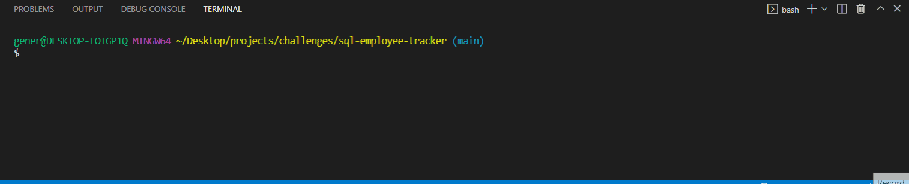

# SQL Command-Line Employee Tracker

 

## **Link** to video walkthrough to demonstrate app functionality: https://drive.google.com/file/d/1CR8SqyQ3coOWY7olChoBmzA_D_-VbJmx/view

 

## **Table of Contents**

[Motivation and Code Overview?](#motivation-and-code-overview)  
[Technologies Used](#technologies-used)  
[User Story](#user-story) 
[Instructions to Run App](#instructions-to-run-app) 
[Screenshot](#screenshot) 
[Things I learned](#things-i-learned)  
[What makes this project stand out?](#what-makes-this-project-stand-out)  
[How to Contribute](#how-to-contribute) 
[Credits](#credits) 

 

## **Motivation and Code Overview**

To create a command-line app that helps manage a company's employee database using Node.js, Inquirer and mySQL2. You can view or add departments, roles, or employees and update an employee. My goal with this application was to perfect asynchronous javascript so I kept it all in one server.js file. In an ideal application, it would be modularized by the prompt chosen by the user. Meaning each of the seven actions you can take would be coded into a different .js file. Right now it uses switch statements. The db folder contains the databse connection, model schema and seeds.

My employee tracker app allows non-developers to easily view and intereact with information stored in a database. The app is a mix of inquirer prompts, whose returned answer objects are then used to query the database. I used an inquirer prompt to create an initial menu to ask what the user wants to do. From there a switch statement manages the flow of the app. No matter what the user chooses, they are always brought back to the main menu.

 

## **Technologies Used**

-   Inquirer
-   Mysql2
-   Console.table
-   Javascript

## **User Story**

AS A business owner
I WANT to be able to view and manage the departments, roles, and employees in my company
SO THAT I can organize and plan my business

GIVEN a command-line application that accepts user input 

-   WHEN I start the application 
    THEN I am presented with the following options: view all departments, view all roles, view all employees, add a department, add a role, add an employee, and update an employee role

-   WHEN I choose to view all departments 
    THEN I am presented with a formatted table showing department names and department ids

-   WHEN I choose to view all roles 
    THEN I am presented with the job title, role id, the department that role belongs to, and the salary for that role

-   WHEN I choose to view all employees 
    THEN I am presented with a formatted table showing employee data, including employee ids, first names, last names, job titles, departments, salaries, and managers that the employees report to

-   WHEN I choose to add a department 
    THEN I am prompted to enter the name of the department and that department is added to the database

-   WHEN I choose to add a role 
    THEN I am prompted to enter the name, salary, and department for the role and that role is added to the database

-   WHEN I choose to add an employee 
    THEN I am prompted to enter the employee’s first name, last name, role, and manager, and that employee is added to the database

-   WHEN I choose to update an employee role 
    THEN I am prompted to select an employee to update and their new role and this information is updated in the database

 

## **Instructions to Run App**

-Clone the repo locally 

-Install MySQL if you don't already have it on your machine and configured. A few resources if you need help: 
a walkthrough provided by the University of Milwaukee: Extended Campus coding bootcamp: https://coding-boot-camp.github.io/full-stack/mysql/mysql-installation-guide  
for windows: https://dev.mysql.com/downloads/mysql/  

-In the root directory of the local repo, connect to MySQL with the following command: 

`mysql -u <username> -p` 

then enter the case-sensitive password you created when configuring MySQL 

-To create and access the database and create the tables, run the following two commands from the mysql> command line: 

`source db/db.sql` 

`source db/schema.sql` 

-If you don't want to use seed data, skip to the next step. To seed: run the following command: 

`source db/seeds.sql` 

-To return to the terminal command line, run the commmand: 

`quit` 

-To run the application type the following command: 

`node server.js` 

-Follow the prompts and enjoy!

 

## **Screenshot**

  

## **Things I learned**

-   There are multiple ways to do a self join. I was having trouble using one way when combining with other left joins; I believe the WHERE statement was throwing off the other left joins. To solve this issue I used a left join as a self join with some help from good ol' google.
-   The value of constructor functions and classes and modularization. I was short on time, otherwise I would've moved every function and query to separate files because the server.js file is CROWDED.

     

## **What makes this project stand out?**

The easy command line interface makes this project stand out. I use a lot of statements in parens to walk the user through the questions and main menu. I can't imagine someone would use something like this professionally without also adding the ability to export the database to an html/excel file, but I see the opportunity for improvement and the apps usefullness.

 

## **How to Contribute**

Please feel free to review, refactor and submit a pull request for additional features on my github page:  
https://github.com/alinz07

 

### **Credits**

-   I used the left join self join syntax demonstrated by www.mysqltutorial.org. Web address: https://www.mysqltutorial.org/mysql-self-join/
